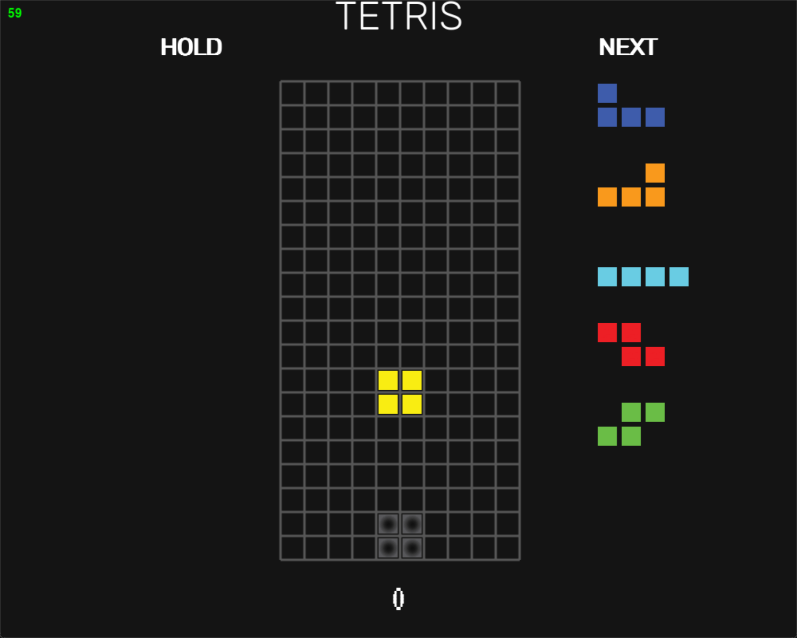

# Tetra Tetra
[](https://forthebadge.com)
[](https://forthebadge.com)

A modern Tetris clone using Python 3 and pygame.



This served as my Computer Science 20 (Grade 11) final project. We were tasked with making a project that demonstrated the use of:
- Procedural Programming (Rotation Algorithms, Game Logic, etc.)
- Data Structures (Board, Pieces, etc.)
- Files and File Structures (Settings and High scores)

## Quick Start

Everything you need to get up and running.
*This guide assumes that you have git, python3, and pip installed properly*

```
git clone https://github.com/TheeeEVan/tetra-tetra
cd tetra-tetra
pip install -r requirements.txt
python main.py
```

## Requirements
This project uses the following packages:
- pygame
- pychalk

## Handling
The handling options in modern Tetris are complex, so here's a easy to understand explanation. Play around with these settings until they feel good!

### Auto Repeat Rate (ARR)

The auto repeat rate is the amount of time (ms) between each movement when repeating. For example if you were holding down the `right` key and your ARR was set to 10ms, once the piece has started moving on its own, every 10ms the piece will move one cell to the right. Smaller values mean faster movement, but less control.

### Delayed Auto Shift (DAS)

Delayed auto shift is the amount of time (ms) it takes after you hold down a key for automatic movement to start. For example if your DAS was set to 100ms, once you held down the `right` key, the piece would not start moving on it's own for 100ms. This creates a pause before automatic movement to make it easier to move single cells.

### DAS Cut Delay (DCD)

This one is a bit complicated to explain so I'll leave it to [u/MsElle_](https://www.reddit.com/user/MsElle_/) from [this](https://www.reddit.com/r/Tetris/comments/nx9kge/can_someone_explain_what_dcd_is_on_tetrio_and/) reddit post.

**Note:** This post refers to DCD being measures in frames. In tetra-tetra it is measured in ms.

> DCD is a delay before DAS starts to work again after dropping or rotating a piece. For example, if DCD is set to 2f, I'm holding right and tap hard drop, I have to wait 2 frames before DAS starts affecting the newly spawned piece. If it were set to 0f (default), DAS would immediately begin to move the new piece to the right.

### Soft Drop Force (SDF)
Soft drop force is the time (ms) it takes to move one cell down during a soft drop. For example if your SDF is set to 20ms, during a soft drop the piece will move one cell down every 20ms.